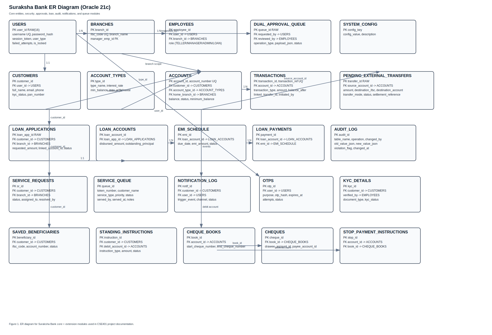

Winter Semester 2026
CSE401 - Database Management System
Project Title: Suraksha Bank - Safe Vault Core Banking System

<Roll no 1> <Name 1>
<Roll no 2> <Name 2>
<Roll no 3> <Name 3>
<Roll no 4> <Name 4> (only if group has 4 students)

A. Description of the Project (System Requirement Specification)

1. Project Overview
Suraksha Bank is a single-bank, multi-branch core banking system developed as an advanced DBMS project. The system is designed using a 3-tier architecture with a web frontend, a Node.js middleware layer, and an Oracle 21c database backend. The goal is to provide secure, role-based banking operations for customer and staff users while preserving ACID properties, auditability, and compliance controls.

The system supports day-to-day banking workflows such as account operations, fund transfers, statement generation, queue handling at teller counters, KYC verification, loan management, cheque operations, deposits (FD/RD), service requests, and system administration.

2. Problem Statement
Suraksha Bank specifically targets the failure points observed in this project's initial prototype and in typical branch-ledger workflows: weak branch scoping, inconsistent transaction checks across screens, and poor forensic visibility after errors. In this project, all branches of one bank share one Oracle 21c core, so the system must guarantee that a user from one role/branch cannot read or mutate out-of-scope data while still allowing high-throughput transaction processing.

For Suraksha Bank, the key DBMS problems are:
1. Strict transactional consistency.
2. Role-segregated access control.
3. Branch scoping rules.
4. Immutable audit records.
5. Approval workflows for high-risk operations.

Suraksha Bank addresses these requirements through Oracle procedures/triggers, API-level RBAC middleware, and session-context-aware checks (via SYS_CONTEXT and trusted context package wrappers).

2.1 Operational Scale and Data Volume Assumptions (Project Scope)
The implementation and report are written for an academic yet production-style load profile:
1. 1 bank with multi-branch operation (seed includes branch-level distribution).
2. 10,000+ customers and 25,000+ accounts as an expected growth target.
3. 100,000+ transaction rows per month (including debit/credit/transfer/fee/interest entries).
4. Daily queue operations and periodic batch/scheduler jobs.
5. Continuous insert growth for AUDIT_LOG and NOTIFICATION_LOG.

These assumptions justify indexed lookup paths, pooled DB connections, queue tables, and scheduler/batch control tables.

3. Objectives
1. Build a production-style core banking schema on Oracle 21c.
2. Implement role-based banking portals with controlled access.
3. Enforce ACID properties in financial transactions.
4. Implement maker-checker approval for high-value transactions.
5. Provide full audit logging and compliance flagging.
6. Demonstrate frontend-backend-database integration.

4. Architecture
4.1 Presentation Tier
Technology: Next.js (React)
Responsibilities:
1. Login and role-based dashboard rendering.
2. Form input collection and client-side validation.
3. Calling backend APIs through authenticated requests.
4. Displaying transaction success and failure responses.

4.2 Application Tier
Technology: Node.js, Express.js, node-oracledb
Responsibilities:
1. Authentication and JWT session validation.
2. Role-based route protection using middleware.
3. Input validation and business-level checks.
4. Calling Oracle stored procedures and returning responses.
5. Setting Oracle session context values for secured DB-side logic when needed.

4.3 Data Tier
Technology: Oracle Database 21c
Responsibilities:
1. Persistent storage of all business entities.
2. Transaction-safe procedure execution.
3. Trigger-based audit and integrity checks.
4. Scheduler jobs for recurring tasks.

4.4 Oracle 21c Security and Context Architecture (Critical)
1. SYS_CONTEXT-driven checks are used by procedures/triggers to enforce branch and reason-aware controls.
2. SURAKSHA_CTX is managed through a trusted package wrapper:
  1. pkg_suraksha_ctx.set_ctx(p_name, p_value)
  2. Context created with: CREATE OR REPLACE CONTEXT SURAKSHA_CTX USING pkg_suraksha_ctx
3. DBMS_SESSION.SET_CONTEXT is not exposed directly to all callers; wrapper-based context setting reduces privilege-risk.
4. VPD-ready architecture: current model already passes role/branch metadata and can be extended to DBMS_RLS policies for row filtering.

4.5 Sequence, Trigger, and Definer-Rights Strategy
1. Oracle sequences are used for deterministic ID/reference generation.
  1. seq_transaction_id for TXN reference generation in trg_transaction_sequence.
  2. CHQ_RANGE_SEQ for cheque range allocation.
2. Definer-rights procedure usage pattern:
  1. Business procedures like sp_record_emi_payment call controlled financial procedures (for example sp_withdraw) from DB-side logic.
  2. This centralizes authorization and audit semantics in one trusted path rather than duplicated app code.
3. Trigger-backed integrity:
  1. Account closure guard (trg_account_closure_check).
  2. Audit immutability guard (trg_prevent_audit_modification).
  3. Velocity/compliance capture (trg_transaction_velocity).

5. User Roles and RBAC
The system enforces RBAC with 5 roles:

1. CUSTOMER
Scope:
1. Own accounts and own transactions only.
Capabilities:
1. View accounts and recent transactions.
2. Internal and external transfer initiation.
3. Statement view/download/email.
4. Beneficiary and standing instructions.
5. Profile/password/KYC status view.
6. Deposit and loan request tracking.

2. TELLER
Scope:
1. Branch-level operational tasks.
Capabilities:
1. Deposit and withdrawal processing.
2. Open account for customer.
3. Customer lookup and statement printing.
4. Queue handling and service request resolution.
5. KYC verification.
6. Cheque issue/stop/clear.
7. Open FD/RD products.

3. BRANCH_MANAGER
Scope:
1. Branch-wide authority.
Capabilities:
1. Approve/reject dual approval queue.
2. Account status changes (active/frozen/closed/dormant).
3. External transfer settlement actions.
4. Branch audit and compliance monitoring.
5. MIS/reports and branch staffing insights.
6. Batch and maturity operations.

4. LOAN_MANAGER
Scope:
1. Loan lifecycle management.
Capabilities:
1. Loan application intake.
2. Status transitions and terms update.
3. EMI schedule generation.
4. Disbursement execution/queueing.
5. EMI repayment posting.
6. Loan closure and portfolio reporting.

5. SYSTEM_ADMIN
Scope:
1. System-wide governance and maintenance.
Capabilities:
1. User and branch administration.
2. Role and status management.
3. Config and fee controls.
4. Scheduler and backup dashboard.
5. Audit and monitor views.

6. Functional Requirements

FR-01 Authentication
1. User login with username/password.
2. Session token generation and validation.
3. Logout with session invalidation.

FR-02 Account Services
1. Customer can view own accounts and balances.
2. Teller can lookup customer account details.
3. Manager can view branch account portfolio.

FR-03 Internal Transfer
1. Transfer between bank accounts using atomic procedure.
2. OTP validation for customer-sensitive flows.
3. High-value transfer must enter dual approval queue.

FR-04 External Transfer
1. Initiation stores PENDING transfer and debits source.
2. Manager approval settles transfer.
3. Rejection flow reverses debit and marks failed state.

FR-05 Cash Operations
1. Teller deposit updates account and transaction log.
2. Teller withdrawal performs minimum-balance checks.
3. Transaction receipt and notifications are generated.

FR-06 Account Opening
1. Teller opens account for valid customer and account type.
2. Initial deposit transaction is recorded.

FR-07 Statement System
1. Customer and teller can request statement by date range.
2. Statement can be downloaded or emailed.

FR-08 KYC Operations
1. Teller verifies KYC documents.
2. KYC audit record is inserted.

FR-09 Deposits Module (FD/RD)
1. Open FD and RD accounts from linked savings/current accounts.
2. Maturity and premature closure logic.

FR-10 Cheque Module
1. Issue cheque books with range controls.
2. Stop payment registration.
3. Cheque clearing and bounce handling.

FR-11 Service Requests
1. Customer raises service requests.
2. Teller/manager resolve requests with branch scoping.

FR-12 Loan Module
1. Intake, review, approval, disbursement.
2. EMI schedule generation and repayment posting.
3. Loan closure with outstanding checks.

FR-13 Audit and Compliance
1. Account and loan status changes are audited.
2. Velocity breach creates compliance flags.
3. Audit table is immutable by trigger.

FR-14 Scheduler and Batch
1. Standing instruction daily execution.
2. Interest and batch logs for operations monitoring.

7. Non-Functional Requirements

1. Security
1. JWT + DB session token validation.
2. Role checks at middleware and route level.
3. OTP for sensitive operations.

2. Reliability
1. ACID transactions using Oracle 21c.
2. Stored procedure encapsulation for critical flows.

3. Performance
1. Connection pooling in node-oracledb.
2. Indexed access for frequent queries.

4. Data Integrity
1. CHECK constraints for status and amount domains.
2. Trigger-based balance/account closure protections.

5. Auditability
1. AUDIT_LOG and PROCEDURE_EXECUTION_LOG support forensic traceability.

8. Key Modules and Implemented Frontend Pages

Customer portal pages (sample):
1. Dashboard
2. Accounts
3. Internal Transfer
4. External Transfer
5. Statements
6. Profile
7. Beneficiaries
8. Standing Instructions
9. Service Requests
10. Cheque Request and Cheque Management
11. KYC
12. Deposits
13. Loans

Teller portal pages (sample):
1. Dashboard
2. Deposit
3. Withdraw
4. Transfer
5. External Transfer
6. Open Account
7. Lookup
8. Statement
9. KYC Verify
10. Open FD/RD
11. Cheque Operations
12. Queue and Service Requests
13. Reports

Manager portal pages (sample):
1. Dashboard
2. Approvals
3. Accounts
4. Settlement
5. Audit
6. Compliance
7. MIS Dashboard
8. Reports
9. Staff
10. Batch Jobs
11. FD/RD Maturity
12. Service Requests

Loan manager pages:
1. Dashboard
2. Intake
3. Applications
4. Disburse
5. Repayments

Admin pages:
1. Dashboard
2. Users
3. Branches
4. Config
5. Fees
6. Audit
7. Scheduler
8. Backup
9. Roles

B. Entity-Relationship Diagram (Image Only)

Recommended caption:
Figure 1: Suraksha Bank ER Diagram showing core, loan, KYC, deposits, cheque, service, and audit domains.

C. Table Design (Data Dictionary / Relational Model)

Note:
1. Primary key shown as PK.
2. Foreign key shown as FK.
3. This dictionary includes base and extended modules used by the implementation scripts.
4. Data types and constraints are aligned with current Oracle SQL scripts in this project.

1) Core Security and Organization

| Table | Purpose | PK | Column-Level Design (type + constraint highlights) |
|---|---|---|---|
| USERS | Authentication identity | user_id RAW(16) | username VARCHAR2(50) UQ NOT NULL, password_hash VARCHAR2(64) NOT NULL, failed_attempts SMALLINT DEFAULT 0, is_locked CHAR(1) DEFAULT '0', session_token VARCHAR2(100), user_type CHECK IN ('CUSTOMER','EMPLOYEE') |
| BRANCHES | Branch master | branch_id VARCHAR2(20) | ifsc_code VARCHAR2(11) UQ NOT NULL, manager_emp_id VARCHAR2(20) FK -> EMPLOYEES, is_active CHAR(1) DEFAULT '1' |
| EMPLOYEES | Staff profile and role | employee_id VARCHAR2(20) | branch_id FK -> BRANCHES, user_id RAW(16) FK -> USERS, role VARCHAR2(20) CHECK IN ('TELLER','BRANCH_MANAGER','SYSTEM_ADMIN','LOAN_MANAGER') |
| CUSTOMERS | Customer profile | customer_id VARCHAR2(20) | user_id RAW(16) FK -> USERS, pan_number VARCHAR2(10) UQ NOT NULL, email/phone UQ, kyc_status CHECK IN ('PENDING','VERIFIED','REJECTED') |

2) Account and Transaction Core

| Table | Purpose | PK | Column-Level Design (type + constraint highlights) |
|---|---|---|---|
| ACCOUNT_TYPES | Product definitions | type_id NUMBER IDENTITY | type_name VARCHAR2(50), interest_rate NUMBER(5,4), min_balance NUMBER(15,2), max_withdrawal NUMBER(15,2) |
| ACCOUNTS | Customer accounts | account_id VARCHAR2(20) | account_number VARCHAR2(18) UQ, customer_id FK -> CUSTOMERS, account_type_id FK -> ACCOUNT_TYPES, home_branch_id FK -> BRANCHES, balance NUMBER(15,2) CHECK >= 0, status CHECK IN ('ACTIVE','DORMANT','FROZEN','CLOSED'), minimum_balance NUMBER(15,2) NOT NULL |
| TRANSACTIONS | Ledger entries | transaction_id NUMBER IDENTITY | transaction_ref VARCHAR2(30) UQ, account_id FK -> ACCOUNTS, transaction_type CHECK IN ('CREDIT','DEBIT','TRANSFER_DEBIT','TRANSFER_CREDIT','INTEREST_CREDIT','FEE_DEBIT','EXTERNAL_DEBIT','EXTERNAL_CREDIT'), amount NUMBER(15,2) CHECK > 0, balance_after NUMBER(15,2) NOT NULL |
| TRANSFER_LOG | Internal transfer linkage | transfer_log_id RAW(16) | debit_txn_id FK -> TRANSACTIONS, credit_txn_id FK -> TRANSACTIONS |
| PENDING_EXTERNAL_TRANSFERS | External transfer queue | transfer_id RAW(16) | source_account_id FK -> ACCOUNTS, amount NUMBER(15,2) CHECK > 0, destination_ifsc CHECK via REGEXP_LIKE, transfer_mode CHECK IN ('RTGS','NEFT','IMPS'), status CHECK IN ('PENDING','SETTLED','REJECTED','CANCELLED') |
| DUAL_APPROVAL_QUEUE | Maker-checker queue | queue_id RAW(16) | requested_by FK -> USERS, reviewed_by FK -> EMPLOYEES, payload_json CLOB, status CHECK IN ('PENDING','APPROVED','REJECTED') |

3) Audit, Compliance and Operations Control

| Table | Purpose | PK | Column-Level Design (type + constraint highlights) |
|---|---|---|---|
| AUDIT_LOG | Immutable change history | audit_id NUMBER IDENTITY | table_name, operation, changed_by, old_value_json CLOB, new_value_json CLOB, violation_flag CHAR(1) DEFAULT '0'; protected by trg_prevent_audit_modification |
| PROCEDURE_EXECUTION_LOG | Procedure execution telemetry | log_id NUMBER IDENTITY | proc_name VARCHAR2(100), called_by VARCHAR2(50), execution_ms INTEGER, success_flag CHAR(1), error_message CLOB |
| COMPLIANCE_FLAGS | Velocity/risk alerts | flag_id NUMBER IDENTITY | account_id FK -> ACCOUNTS, transaction_id FK -> TRANSACTIONS, flag_type, threshold_value NUMBER(15,2) |
| SYSTEM_CONFIG | Runtime config | config_key VARCHAR2(50) | config_value VARCHAR2(200), description CLOB, updated_by FK -> USERS |
| ACCRUAL_BATCH_CONTROL | Batch execution state | run_id NUMBER IDENTITY | bucket_id SMALLINT CHECK BETWEEN 0 AND 9, status CHECK IN ('PENDING','IN_PROGRESS','COMPLETED','FAILED'), UNIQUE(bucket_id, accrual_date) |
| INTEREST_ACCRUAL_LOG | Posted interest entries | accrual_id NUMBER IDENTITY | account_id FK -> ACCOUNTS, batch_run_id FK -> ACCRUAL_BATCH_CONTROL, interest_amount NUMBER(15,2) |

4) Loan Domain

| Table | Purpose | PK | Column-Level Design (type + constraint highlights) |
|---|---|---|---|
| LOAN_APPLICATIONS | Loan application lifecycle | loan_app_id RAW(16) | customer_id FK -> CUSTOMERS, branch_id FK -> BRANCHES, loan_type CHECK IN ('PERSONAL','HOME','VEHICLE','EDUCATION'), tenure_months CHECK 1..360, linked_account_id FK -> ACCOUNTS, status CHECK IN ('RECEIVED','UNDER_REVIEW','APPROVED','DISBURSED','ACTIVE','CLOSED','DEFAULTED') |
| LOAN_ACCOUNTS | Disbursed loan account | loan_account_id VARCHAR2(20) | loan_app_id FK -> LOAN_APPLICATIONS, disbursed_amount CHECK > 0, outstanding_principal CHECK >= 0, status CHECK IN ('ACTIVE','CLOSED','DEFAULTED') |
| EMI_SCHEDULE | Instalment schedule | emi_id NUMBER IDENTITY | loan_account_id FK -> LOAN_ACCOUNTS, emi_amount CHECK > 0, closing_balance CHECK >= 0, status CHECK IN ('PENDING','PAID','OVERDUE'), penalty_amount default 0 |
| LOAN_PAYMENTS | EMI payment ledger | payment_id NUMBER IDENTITY | loan_account_id FK -> LOAN_ACCOUNTS, emi_id FK -> EMI_SCHEDULE, payment_txn_id FK -> TRANSACTIONS, amount_paid CHECK > 0 |

5) Deposits and Fee Domain

| Table | Purpose | PK | Column-Level Design (type + constraint highlights) |
|---|---|---|---|
| FEE_SCHEDULE | Fee and charge rules | fee_id VARCHAR2(40) | fee_amount NUMBER(15,2), is_percentage CHAR(1) CHECK IN ('0','1'), effective_from DATE |
| FD_ACCOUNTS | Fixed deposit records | fd_id NUMBER IDENTITY | customer_id FK -> CUSTOMERS, linked_account_id FK -> ACCOUNTS, principal_amount CHECK > 0, tenure_months CHECK 1..240, status CHECK IN ('ACTIVE','MATURED','CLOSED','PREMATURE_CLOSED') |
| RD_ACCOUNTS | Recurring deposit records | rd_id NUMBER IDENTITY | customer_id FK -> CUSTOMERS, linked_account_id FK -> ACCOUNTS, monthly_instalment CHECK > 0, standing_instr_id FK -> STANDING_INSTRUCTIONS, status CHECK IN ('ACTIVE','MATURED','CLOSED') |

6) KYC, Beneficiaries and Standing Instructions

| Table | Purpose | PK | Column-Level Design (type + constraint highlights) |
|---|---|---|---|
| KYC_DETAILS | KYC verification history | kyc_id NUMBER IDENTITY | customer_id FK -> CUSTOMERS, document_type CHECK IN ('PAN','AADHAAR','PASSPORT'), kyc_status CHECK IN ('VERIFIED','PENDING','EXPIRED'), verified_by FK -> EMPLOYEES |
| SAVED_BENEFICIARIES | Customer beneficiary list | beneficiary_id NUMBER IDENTITY | customer_id FK -> CUSTOMERS, account_number, ifsc_code, activation_status CHECK IN ('PENDING','ACTIVE','DELETED'), UNIQUE(customer_id, account_number, ifsc_code) |
| STANDING_INSTRUCTIONS | Auto-payment setup | instruction_id NUMBER IDENTITY | customer_id FK -> CUSTOMERS, debit_account_id FK -> ACCOUNTS, instruction_type CHECK IN ('INTERNAL_TRANSFER','EXTERNAL_TRANSFER','RD_INSTALMENT','UTILITY_PAYMENT'), frequency CHECK IN ('DAILY','WEEKLY','MONTHLY','QUARTERLY'), status CHECK IN ('ACTIVE','PAUSED','EXPIRED','FAILED') |
| STANDING_INSTRUCTION_LOG | SI execution logs | log_id NUMBER IDENTITY | instruction_id FK -> STANDING_INSTRUCTIONS, status CHECK IN ('SUCCESS','FAILED','SKIPPED'), txn_id FK -> TRANSACTIONS |

7) Cheque and Service Domain

| Table | Purpose | PK | Column-Level Design (type + constraint highlights) |
|---|---|---|---|
| CHEQUE_BOOKS | Issued cheque books | book_id NUMBER IDENTITY | account_id FK -> ACCOUNTS, start_cheque_number UQ, end_cheque_number, leaves_count, status CHECK IN ('ACTIVE','EXHAUSTED','CANCELLED') |
| CHEQUES | Cheque lifecycle events | cheque_id NUMBER IDENTITY | cheque_number UQ, book_id FK -> CHEQUE_BOOKS, drawee_account_id/payee_account_id FK -> ACCOUNTS, status CHECK IN ('PRESENTED','CLEARED','BOUNCED','STOPPED') |
| STOP_PAYMENT_INSTRUCTIONS | Stop-payment records | stop_id NUMBER IDENTITY | cheque_number, account_id FK -> ACCOUNTS, book_id FK -> CHEQUE_BOOKS, recorded_by FK -> EMPLOYEES, status CHECK IN ('ACTIVE','REVOKED') |
| SERVICE_REQUESTS | Customer service requests | sr_id NUMBER IDENTITY | customer_id FK -> CUSTOMERS, branch_id FK -> BRANCHES, request_type CHECK IN ('ADDRESS_CHANGE','MOBILE_UPDATE','EMAIL_UPDATE','ACCOUNT_UPGRADE','OTHER'), status CHECK IN ('PENDING','ASSIGNED','RESOLVED','REJECTED') |
| SERVICE_QUEUE | Counter token queue | queue_id NUMBER IDENTITY | token_number VARCHAR2(20) NOT NULL, customer_name VARCHAR2(100) NOT NULL, service_type VARCHAR2(50) NOT NULL, priority CHECK IN (1,2,3), status CHECK IN ('WAITING','SERVING','SERVED','CANCELLED'), served_by VARCHAR2(50), served_at TIMESTAMP WITH TIME ZONE, notes CLOB |

8) Notification and OTP

| Table | Purpose | PK | Column-Level Design (type + constraint highlights) |
|---|---|---|---|
| NOTIFICATION_LOG | Email/SMS/in-app dispatch queue | notif_id NUMBER IDENTITY | customer_id FK -> CUSTOMERS, user_id RAW(16) FK -> USERS, trigger_event VARCHAR2(40) NOT NULL, channel CHECK IN ('EMAIL','SMS','IN_APP'), message_clob CLOB NOT NULL, status CHECK IN ('QUEUED','SENT','FAILED'), resend_message_id VARCHAR2(40) |
| OTPS | One-time password records | otp_id NUMBER IDENTITY | user_id RAW(16) FK -> USERS ON DELETE CASCADE, transaction_id VARCHAR2(100), otp_hash VARCHAR2(255) NOT NULL, purpose VARCHAR2(50) NOT NULL, expires_at TIMESTAMP NOT NULL, attempts NUMBER DEFAULT 0, status CHECK IN ('PENDING','SUCCESS','FAILED') |

9) Note on DEBIT_CARDS Table
In the current workspace SQL implementation, DEBIT_CARDS table creation is not present in the Oracle scripts executed by run_all.sql. Hence, it is intentionally excluded from the implemented relational model section for this submission.

D. Code to Connect Front-end and Back-end

1. Database Pool Initialization (Node.js)
~~~javascript
const oracledb = require('oracledb');

oracledb.outFormat = oracledb.OUT_FORMAT_OBJECT;
oracledb.autoCommit = true;

async function initSession(connection, requestedTag, callback) {
  try {
    // Safe default context for pooled sessions; role-specific context is set after auth.
    await connection.execute(
      `BEGIN
         pkg_suraksha_ctx.set_ctx(:k1, :v1);
         pkg_suraksha_ctx.set_ctx(:k2, :v2);
       END;`,
      {
        k1: 'role',
        v1: 'ANON',
        k2: 'branch_id',
        v2: 'GLOBAL'
      }
    );
    callback();
  } catch (err) {
    callback(err);
  }
}

async function initializeDBPool() {
  await oracledb.createPool({
    user: process.env.DB_USER,
    password: process.env.DB_PASSWORD,
    connectString: process.env.DB_CONNECTION_STRING,
    poolMin: 2,
    poolMax: 10,
    poolIncrement: 1,
    sessionCallback: initSession
  });
}
~~~

1.1 Session Context Bootstrap (Oracle 21c)
~~~javascript
// Called after authentication for context-aware procedures/triggers.
async function setSessionContext(connection, ctx) {
  // Preferred via trusted package wrapper (pkg_suraksha_ctx)
  await connection.execute(
    `BEGIN pkg_suraksha_ctx.set_ctx(:k1, :v1); pkg_suraksha_ctx.set_ctx(:k2, :v2); END;`,
    {
      k1: 'role',
      v1: ctx.role,
      k2: 'branch_id',
      v2: ctx.branchId || 'GLOBAL'
    }
  );
}
~~~

1.2 ACID Transaction Pattern for Critical Procedure Calls
~~~javascript
const connection = await oracledb.getConnection();
try {
  // Explicit Oracle transaction isolation for critical financial operation.
  await connection.execute(`SET TRANSACTION ISOLATION LEVEL SERIALIZABLE`);
  await connection.execute(
    `BEGIN sp_deposit(:account_id, :amount, :teller_id); END;`,
    { account_id: accountId, amount: Number(amount), teller_id: tellerId }
  );
  await connection.commit();
} catch (e) {
  await connection.rollback();
  throw e;
} finally {
  await connection.close();
}
~~~

2. Express Route Mounting (Node.js)
~~~javascript
app.use('/api/auth', authRoutes);
app.use('/api/customer', customerRoutes);
app.use('/api/teller', tellerRoutes);
app.use('/api/manager', managerRoutes);
app.use('/api/admin', adminRoutes);
app.use('/api/loan-manager', loanManagerRoutes);
~~~

3. Frontend Login API Call (Next.js)
~~~javascript
const res = await fetch('http://localhost:5000/api/auth/login', {
  method: 'POST',
  headers: { 'Content-Type': 'application/json' },
  body: JSON.stringify({ username, password })
});
const data = await res.json();
~~~

4. Frontend Transfer Call (Customer)
~~~javascript
const res = await fetch('http://localhost:5000/api/customer/transfer/internal', {
  method: 'POST',
  headers: {
    'Content-Type': 'application/json',
    'Authorization': 'Bearer ' + token
  },
  body: JSON.stringify({
    fromAccountId,
    toAccountId,
    amount,
    otpCode
  })
});
~~~

5. Backend Procedure Invocation Example
~~~javascript
await connection.execute(
  'BEGIN sp_internal_transfer(:sender, :receiver, :amount, :initiated_by); END;',
  {
    sender: fromAccountId,
    receiver: toAccountId,
    amount: Number(amount),
    initiated_by: userId
  },
  { autoCommit: true }
);
~~~

6. Actual Deposit Procedure with Row Locking and Fee Logic (Oracle SQL)
~~~sql
CREATE OR REPLACE PROCEDURE sp_deposit (
  p_account_id IN VARCHAR2,
  p_amount IN NUMBER,
  p_teller_id IN VARCHAR2
) AS
  v_balance NUMBER;
  v_status  VARCHAR2(10);
  v_fee     NUMBER;
BEGIN
  EXECUTE IMMEDIATE 'SET TRANSACTION ISOLATION LEVEL SERIALIZABLE';

  -- Lock account row before update to avoid race conditions.
  SELECT balance, status INTO v_balance, v_status
  FROM ACCOUNTS
  WHERE account_id = p_account_id
  FOR UPDATE WAIT 5;

  IF v_status NOT IN ('ACTIVE', 'DORMANT') THEN
    RAISE_APPLICATION_ERROR(-20003, 'Account is not eligible for deposit.');
  END IF;

  UPDATE ACCOUNTS
  SET balance = balance + p_amount
  WHERE account_id = p_account_id;

  INSERT INTO TRANSACTIONS (account_id, transaction_type, amount, balance_after, initiated_by)
  VALUES (p_account_id, 'CREDIT', p_amount, v_balance + p_amount, p_teller_id);

  v_fee := fn_calculate_fee('CASH_DEP', p_amount);
  IF v_fee > 0 THEN
    UPDATE ACCOUNTS SET balance = balance - v_fee WHERE account_id = p_account_id;
    INSERT INTO TRANSACTIONS (account_id, transaction_type, amount, balance_after, initiated_by, description)
    VALUES (p_account_id, 'FEE_DEBIT', v_fee, v_balance + p_amount - v_fee, 'SYSTEM', 'Cash Deposit Fee');
  END IF;

  COMMIT;
EXCEPTION
  WHEN OTHERS THEN
    ROLLBACK;
    RAISE;
END;
/
~~~

E. Stored Procedures, Functions and Triggers
(With code and statement to call/fire them from front-end)

1. Major Stored Procedures Implemented

Core Banking:
1. sp_internal_transfer
2. sp_deposit
3. sp_withdraw
4. sp_open_account
5. sp_initiate_external_transfer
6. sp_approve_external_transfer
7. sp_reject_external_transfer
8. sp_generate_statement
9. sp_submit_dual_approval
10. sp_approve_dual_queue
11. sp_reject_dual_queue
12. sp_set_account_status
13. sp_change_password (implementation available in backend install script; frontend uses /api/customer/change-password path)

Loan Module:
1. sp_generate_emi_schedule
2. sp_disburse_loan
3. sp_record_emi_payment
4. sp_close_loan
5. sp_update_loan_status
6. sp_mark_loan_overdue

KYC and Service:
1. sp_verify_kyc
2. sp_create_service_request
3. sp_resolve_service_request

Deposits and Cheque:
1. sp_open_fd
2. sp_open_rd
3. sp_process_fd_maturity
4. sp_premature_fd_closure
5. sp_issue_cheque_book
6. sp_record_stop_payment
7. sp_process_cheque_clearing

Standing Instructions and MIS:
1. sp_create_standing_instruction
2. sp_execute_standing_instruction
3. sp_execute_all_standing_instructions
4. sp_deduct_service_charges
5. sp_generate_mis_report
6. sp_generate_branch_mis

Beneficiary and OTP Related:
1. sp_add_beneficiary
2. sp_activate_beneficiary
3. OTP lifecycle handled by OTPS table + backend generation/verification routes (/api/otp/generate and verifyOtp helper)

2. Functions Implemented
1. fn_calculate_fee
2. fn_get_average_balance
3. fn_get_branch_pool_account (fix script path for bank pool account routing)

3. Triggers Implemented
1. trg_audit_balance_change
2. trg_audit_status_change
3. trg_transaction_sequence
4. trg_account_closure_check
5. trg_transaction_velocity
6. trg_prevent_audit_modification
7. trg_audit_kyc_change
8. trg_cheque_book_validate
9. trg_audit_fd_status
10. trg_prevent_sr_modification
11. Additional audit triggers from enhancement script:
   1. TRG_AUDIT_LOAN_STATUS
   2. TRG_AUDIT_ACCOUNT_WRITE
   3. TRG_AUDIT_TRANSACTION
   4. TRG_AUDIT_DUAL_APPROVAL

4. Procedure Detail: sp_deposit (ACID-Safe)
Key safeguards:
1. Row-level lock on account row with timeout (FOR UPDATE WAIT 5).
2. Eligibility check by status.
3. Explicit rollback on failure.
4. Separate fee debit entry through function-based fee calculation.
5. SERIALIZABLE transaction isolation for critical financial updates.

Code reference used in project SQL scripts:
~~~sql
SELECT balance, status INTO v_balance, v_status
FROM ACCOUNTS WHERE account_id = p_account_id FOR UPDATE WAIT 5;
~~~

5. Procedure Code Example
~~~sql
CREATE OR REPLACE PROCEDURE sp_deposit (
    p_account_id IN VARCHAR2,
    p_amount IN NUMBER,
    p_teller_id IN VARCHAR2
) AS
  v_balance NUMBER;
  v_status  VARCHAR2(10);
  v_fee     NUMBER;
BEGIN
  EXECUTE IMMEDIATE 'SET TRANSACTION ISOLATION LEVEL SERIALIZABLE';

  SELECT balance, status INTO v_balance, v_status
  FROM ACCOUNTS
  WHERE account_id = p_account_id
  FOR UPDATE WAIT 5;

  IF v_status NOT IN ('ACTIVE', 'DORMANT') THEN
    RAISE_APPLICATION_ERROR(-20003, 'Account is not eligible for deposit.');
  END IF;

    UPDATE ACCOUNTS
    SET balance = balance + p_amount
    WHERE account_id = p_account_id;

    INSERT INTO TRANSACTIONS (account_id, transaction_type, amount, balance_after, initiated_by)
    VALUES (p_account_id, 'CREDIT', p_amount, v_balance + p_amount, p_teller_id);

  v_fee := fn_calculate_fee('CASH_DEP', p_amount);
  IF v_fee > 0 THEN
    UPDATE ACCOUNTS SET balance = balance - v_fee WHERE account_id = p_account_id;
    INSERT INTO TRANSACTIONS (account_id, transaction_type, amount, balance_after, initiated_by, description)
    VALUES (p_account_id, 'FEE_DEBIT', v_fee, v_balance + p_amount - v_fee, 'SYSTEM', 'Cash Deposit Fee');
  END IF;

    COMMIT;
EXCEPTION
  WHEN OTHERS THEN
    ROLLBACK;
    RAISE;
END;
/
~~~

Frontend statement that calls this procedure:
1. Frontend page submits POST request to API /api/teller/deposit.
2. Backend route executes:
~~~sql
BEGIN sp_deposit(:account_id, :amount, :teller_id); END;
~~~

Additional frontend-to-procedure mappings:
1. /api/customer/beneficiaries -> sp_add_beneficiary
2. /api/customer/beneficiaries/activate -> sp_activate_beneficiary
3. /api/customer/change-password -> updates USERS.password_hash (procedure variant sp_change_password available)

Beneficiary procedure snippet:
~~~sql
CREATE OR REPLACE PROCEDURE sp_add_beneficiary (
  p_customer_id IN VARCHAR2,
  p_account_number IN VARCHAR2,
  p_ifsc IN VARCHAR2,
  p_bank_name IN VARCHAR2,
  p_name IN VARCHAR2,
  p_nickname IN VARCHAR2
) AS
BEGIN
  INSERT INTO SAVED_BENEFICIARIES (
    customer_id, account_number, ifsc_code, bank_name, beneficiary_name, nickname,
    activation_status, activation_date
  ) VALUES (
    p_customer_id, p_account_number, p_ifsc, p_bank_name, p_name, p_nickname,
    'PENDING', SYSTIMESTAMP + INTERVAL '24' HOUR
  );
  COMMIT;
EXCEPTION
  WHEN DUP_VAL_ON_INDEX THEN
    RAISE_APPLICATION_ERROR(-20060, 'Beneficiary already exists.');
END;
/
~~~

Password change procedure snippet (available in project backend install script):
~~~sql
CREATE OR REPLACE PROCEDURE sp_change_password (
  p_user_id IN VARCHAR2,
  p_new_hash IN VARCHAR2
) AS
BEGIN
  UPDATE USERS
  SET password_hash = p_new_hash
  WHERE user_id = p_user_id;
  COMMIT;
END;
/
~~~

6. Function Code Example
~~~sql
CREATE OR REPLACE FUNCTION fn_calculate_fee (
    p_fee_id IN VARCHAR2,
    p_amount IN NUMBER
) RETURN NUMBER AS
    v_fee_amt NUMBER;
BEGIN
    SELECT fee_amount INTO v_fee_amt
    FROM FEE_SCHEDULE
    WHERE fee_id = p_fee_id;

    RETURN v_fee_amt;
EXCEPTION
    WHEN NO_DATA_FOUND THEN
        RETURN 0;
END;
/
~~~

Function call statement:
~~~sql
SELECT fn_calculate_fee('IMPS', 50000) AS transfer_fee FROM dual;
~~~

7. Trigger Code Example
~~~sql
CREATE OR REPLACE TRIGGER trg_account_closure_check
BEFORE UPDATE OF status ON ACCOUNTS
FOR EACH ROW
WHEN (NEW.status = 'CLOSED')
BEGIN
    IF :OLD.balance > 0 THEN
        RAISE_APPLICATION_ERROR(-20002, 'Account closure rejected: Balance must be zero.');
    END IF;
END;
/
~~~

8. Error-Code Design Notes (Conflict Resolution)
Current script reality:
1. ORA-20002 is used in multiple places (receiver-account inactive and account-closure rejection), which can cause ambiguous error handling.

Recommended normalized scheme for final viva/report discussion:
1. ORA-20002: Receiver account not ACTIVE.
2. ORA-20003: Account state disallows operation.
3. ORA-20010: Account closure/business-rule rejection (for closure conflict clarity).
4. ORA-20011/20012: Loan state transition and EMI state conflicts.

If code refactoring is done later, map trigger closure error to ORA-20010 and keep ORA-20002 transfer-specific.

9. Trigger/Function Implementation Notes
1. trg_transaction_velocity inserts COMPLIANCE_FLAGS when daily debit total breaches configured velocity limit.
2. trg_transaction_sequence uses seq_transaction_id to generate deterministic transaction_ref.
3. fn_get_average_balance computes average monthly balance from account and transaction snapshots for interest routines.

How trigger is fired from frontend flow:
1. Manager attempts account status change to CLOSED from manager accounts page.
2. Frontend calls API /api/manager/accounts/{id}/status.
3. Backend invokes procedure sp_set_account_status.
4. Trigger fires on ACCOUNTS update and returns Oracle error if balance > 0.

F. Screenshots of Results Generated After Procedures and Functions are Called on Front-end

Add screenshots in this sequence with figure captions.

1. Login Success
Capture: Successful login for each role and redirect to respective dashboard.
Caption: Figure F1 - Role-based login success.

2. Customer Internal Transfer Success
Capture: Message showing transfer completed and reference number.
Procedure involved: sp_internal_transfer.
Caption: Figure F2 - Internal transfer success from customer portal.

3. Teller Cash Deposit Success
Capture: Deposit success with updated balance.
Procedure involved: sp_deposit.
Caption: Figure F3 - Teller deposit committed to Oracle.

4. Teller Cash Withdrawal Success
Capture: Withdrawal confirmation and new balance.
Procedure involved: sp_withdraw.
Caption: Figure F4 - Teller withdrawal success.

5. Account Opening Success
Capture: New account created with account ID.
Procedure involved: sp_open_account.
Caption: Figure F5 - New account opening result.

6. Manager Approval Success
Capture: Pending high-value queue item changed to approved.
Procedure involved: sp_approve_dual_queue.
Caption: Figure F6 - Dual-approval queue processing.

7. External Transfer Settlement Success
Capture: Manager settlement approval response.
Procedure involved: sp_approve_external_transfer.
Caption: Figure F7 - External transfer settlement.

8. Loan Application Intake Success
Capture: Loan app created with loan_app_id.
Procedure involved: loan-manager intake insert and workflow.
Caption: Figure F8 - Loan intake operation.

9. EMI Generation Success
Capture: EMI schedule generated message and EMI list.
Procedure involved: sp_generate_emi_schedule.
Caption: Figure F9 - EMI schedule generation.

10. EMI Payment Success
Capture: EMI payment recorded successfully.
Procedure involved: sp_record_emi_payment.
Caption: Figure F10 - EMI repayment posting.

11. KYC Verification Success
Capture: Teller KYC verification success response.
Procedure involved: sp_verify_kyc.
Caption: Figure F11 - KYC verification completed.

12. Statement Download/Preview
Capture: Statement screen with records or download confirmation.
Procedure involved: sp_generate_statement.
Caption: Figure F12 - Statement retrieval result.

13. Function Result (Fee Calculation)
Capture: UI/API response where transfer fee is applied in transaction flow.
Function involved: fn_calculate_fee.
Caption: Figure F13 - Fee function effect in transaction.

G. Screenshots of Errors Generated on Front-end When Trigger is Fired

Important:
Take screenshots of the visible error message shown in frontend UI.

1. Trigger Error Case 1: Account Closure with Non-Zero Balance
Trigger: trg_account_closure_check
How to generate:
1. Open manager account management page.
2. Select an account with positive balance.
3. Try to set status to CLOSED.
Expected error:
Account closure rejected: Balance must be zero.
Caption: Figure G1 - Trigger-based rejection for invalid account closure.

2. Trigger Error Case 2: Cheque Number Outside Issued Range
Trigger: trg_cheque_book_validate
How to generate:
1. Open teller cheque operation page.
2. Attempt cheque processing with number outside active cheque book range.
Expected error:
Cheque number not found in this book.
Caption: Figure G2 - Trigger validation failure in cheque module.

3. Trigger Error Case 3: Modify Resolved Service Request
Trigger: trg_prevent_sr_modification
How to generate:
1. Resolve a service request.
2. Attempt to update it again via resolve action.
Expected error:
Resolved service requests are immutable.
Caption: Figure G3 - Trigger-enforced immutability for service requests.

4. Trigger Error Case 4: Audit Log Tampering Attempt (Optional but Strong)
Trigger: trg_prevent_audit_modification
How to generate:
1. Attempt update/delete operation on audit entry through admin maintenance flow or debug endpoint.
Expected error:
Audit log records cannot be modified or deleted.
Caption: Figure G4 - Audit immutability trigger in action.

Individual Contribution (Mandatory)

Add this section at the end of final report:

| Student | Roll Number | Contribution Area | Percentage |
|---|---|---|---|
| Student 1 | <Roll no 1> | Database schema, procedures, triggers, SQL setup | 34% |
| Student 2 | <Roll no 2> | Backend API, RBAC middleware, Oracle integration | 33% |
| Student 3 | <Roll no 3> | Frontend pages, API integration, testing and screenshots | 33% |
| Student 4 (if applicable) | <Roll no 4> | Documentation, reports, extra module support | 0-25% (adjust totals to 100%) |

Rule:
Total must be exactly 100%.

Submission Checklist (Before Upload)

1. File name format:
Rollno1FirstnameLastname1_Rollno2FirstnameLastname2_Rollno3FirstnameLastname3
(If 4 members, append fourth similarly.)

2. Cover page filled exactly as required.

3. Sequence strictly followed:
A, B, C, D, E, F, G.

4. ER section has image only.

5. Procedure, function, trigger code included.

6. Frontend call statements included.

7. Screenshot captions added for all figures.

8. Individual percentage contributions added and total equals 100.

9. Save as Word file and upload before deadline.
